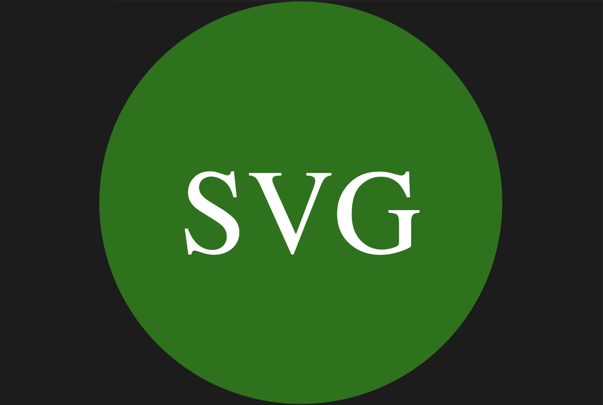

# Hicham Raffiai Idrissi'  Week 10 Challenge: SVG LOGO MAKER

[](https://opensource.org/licenses/MIT)
  
## Description:
The application enables users to enter inputs into a inquirer prompt in order to generate a logo "logo.svg" file which contains the users desired results as an SVG image.

## Table of Contents:
- [Overview](#Overview)
- [The Challenge](#The-Challenge)
- [License](#License)
- [Author](#Author)


# Overview

## The Challenge:
Build a Node.js command-line application that takes in user inputs to generates a SVG logo and saves it as "logo.svg" file. In addition, create a walkthrough video that demonstrates its functionality and the passing of all of the tests.


## User Story
```md
AS a freelance web developer
I WANT to generate a simple logo for my projects
SO THAT I don't have to pay a graphic designer
```

## Acceptance Criteria

GIVEN a command-line application that accepts user input
WHEN I am prompted for text
THEN I can enter up to three characters
WHEN I am prompted for the text color
THEN I can enter a color keyword (OR a hexadecimal number)
WHEN I am prompted for a shape
THEN I am presented with a list of shapes to choose from: circle, triangle, and square
WHEN I am prompted for the shape's color
THEN I can enter a color keyword (OR a hexadecimal number)
WHEN I have entered input for all the prompts
THEN an SVG file is created named `logo.svg`
AND the output text "Generated logo.svg" is printed in the command line
WHEN I open the `logo.svg` file in a browser
THEN I am shown a 300x200 pixel image that matches the criteria I entered


# walk through video link:
https://drive.google.com/file/d/12LfMacS9LHArEoisruorcSpTR8cRpOE9/view

## Screenshots:
# Generated "logo.svg" file

# running node index.js

# User Questions for the shapes


## License & Copyright ©
  
[](https://opensource.org/licenses/MIT) [Open Source Initiative Link](https://opensource.org/licenses/MIT)

### Copyright © 2023 
```md
Permission is hereby granted, free of charge, to any person obtaining a copy
of this software and associated documentation files (the "Software"), to deal
in the Software without restriction, including without limitation the rights
to use, copy, modify, merge, publish, distribute, sublicense, and/or sell
copies of the Software, and to permit persons to whom the Software is
furnished to do so, subject to the following conditions:

The above copyright notice and this permission notice shall be included in all
copies or substantial portions of the Software.

THE SOFTWARE IS PROVIDED "AS IS", WITHOUT WARRANTY OF ANY KIND, EXPRESS OR
IMPLIED, INCLUDING BUT NOT LIMITED TO THE WARRANTIES OF MERCHANTABILITY,
FITNESS FOR A PARTICULAR PURPOSE AND NONINFRINGEMENT. IN NO EVENT SHALL THE
AUTHORS OR COPYRIGHT HOLDERS BE LIABLE FOR ANY CLAIM, DAMAGES OR OTHER
LIABILITY, WHETHER IN AN ACTION OF CONTRACT, TORT OR OTHERWISE, ARISING FROM,
OUT OF OR IN CONNECTION WITH THE SOFTWARE OR THE USE OR OTHER DEALINGS IN THE
SOFTWARE.
```
